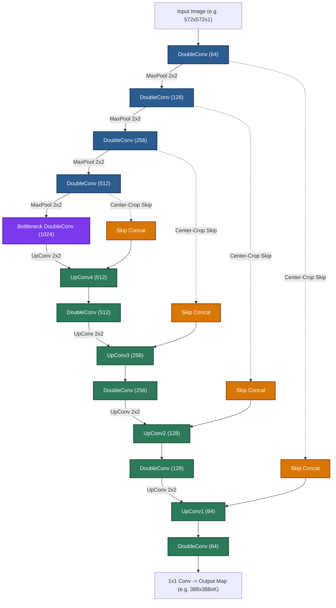

# U-Net: Convolutional Networks for Biomedical Image Segmentation

[](https://www.python.org/)
[](https://pytorch.org/)
[](https://albumentations.ai/)
[](https://opensource.org/licenses/MIT)
[](https://colab.research.google.com/drive/1WMommKGaYXy8R0Z71qM867zjbni_k6mG?usp=sharing)

A comprehensive, clean, and modular PyTorch reimplementation of the seminal paper:

> **[U-Net: Convolutional Networks for Biomedical Image Segmentation](file:///c:/Omkar/Deep%20Learning/U-Net%20Convolutional%20Networks%20for%20Biomedical%20Image%20Segmentation.pdf)**  
> *Olaf Ronneberger, Philipp Fischer, and Thomas Brox*  
> **MICCAI 2015**, LNCS 9351, pp. 234–241.

---

## 📌 Table of Contents

- [Overview](#-overview)
- [Key Features](#-key-features)
- [Architecture](#-architecture)
- [Mathematical Highlights](#-mathematical-highlights)
  - [1. Weighted Pixel-Wise Cross-Entropy (Eq. 1)](#1-weighted-pixel-wise-cross-entropy-loss-eq-1)
  - [2. Boundary Weight Map Formulation (Eq. 2)](#2-boundary-weight-map-formulation-eq-2)
  - [3. He / Kaiming Initialization (§3)](#3-he--kaiming-initialization-3)
- [Paper vs. Implementation Mapping](#-paper-vs-implementation-mapping)
- [Project Structure](#-project-structure)
- [Getting Started](#-getting-started)
  - [Prerequisites](#prerequisites)
  - [Running the Notebook](#running-the-notebook)
- [Using Custom & Real-World Datasets](#-using-custom--real-world-datasets)
- [Metrics & Qualitative Evaluation](#-metrics--qualitative-evaluation)
- [Citation & References](#-citation--references)

---

## 🔬 Overview

Biomedical image segmentation presents unique challenges:
1. **Extremely limited training data** (often dozens of annotated microscopy images).
2. **Touching instances of the same cell type**, requiring precise boundary separation without instance merging.

This repository provides an end-to-end PyTorch implementation replicating the paper's core innovations:
- **Contracting & Expansive Paths** connected via skip connections and feature cropping.
- **Instance-aware boundary loss weighting** via Euclidean distance transforms to separate touching cells.
- **Smooth elastic deformations** for realistic shape augmentation on small sample sizes.
- **Standalone runnable pipeline** with an on-the-fly synthetic microscopy dataset generator (zero manual dataset download needed to test immediately).

---

## ✨ Key Features

- **Dual Architecture Variants**:
  - `UNetOriginal`: Exact paper architecture using unpadded ($3 \times 3$, `padding=0`) convolutions, spatial shrinkage (e.g., $572 \times 572 \to 388 \times 388$), and center-cropped skip connections.
  - `UNetPadded`: "Same"-padding variant (`padding=1`, preserving dimensions $H \times W$) for general segmentation pipelines.
- **Instance Boundary Weighting**: Computes exact Eq. (2) weights using `scipy.ndimage.distance_transform_edt` to heavily penalize errors on touching cell borders.
- **Paper-Accurate Elastic Augmentations**: Configured using Albumentations with coarse grid deformations ($\sigma = 10\text{ px}$) mimicking biological tissue deformation.
- **Kaiming / He Initialization**: Proper `std = sqrt(2 / N)` fan-in initialization where $N = 3 \times 3 \times C_{\text{in}}$.
- **Training & Metrics**: High-momentum SGD ($0.99$), Mean IoU (Jaccard Index), Pixel Accuracy, and qualitative 4-panel visual validation.

---

## 🏗 Architecture



---

## 📐 Mathematical Highlights

### 1. Weighted Pixel-Wise Cross-Entropy Loss (Eq. 1)

$$E = \sum_{\mathbf{x} \in \Omega} w(\mathbf{x}) \log\left(p_{\ell(\mathbf{x})}(\mathbf{x})\right)$$

where:
- $\Omega$ is the image pixel domain.
- $p_k(\mathbf{x}) = \frac{\exp(a_k(\mathbf{x}))}{\sum_{k'=1}^K \exp(a_{k'}(\mathbf{x}))}$ is the softmax activation over class feature maps.
- $\ell(\mathbf{x}) \in \{1, \dots, K\}$ is the ground-truth label of pixel $\mathbf{x}$.
- $w(\mathbf{x}) : \Omega \to \mathbb{R}$ is the spatial weight map.

### 2. Boundary Weight Map Formulation (Eq. 2)

$$w(\mathbf{x}) = w_c(\mathbf{x}) + w_0 \cdot \exp\left(-\frac{(d_1(\mathbf{x}) + d_2(\mathbf{x}))^2}{2\sigma^2}\right)$$

where:
- $w_c(\mathbf{x})$ balances class frequencies across foreground and background.
- $d_1(\mathbf{x})$: Distance from pixel $\mathbf{x}$ to the border of the **nearest** cell instance.
- $d_2(\mathbf{x})$: Distance to the border of the **second-nearest** cell instance.
- $w_0 = 10$ and $\sigma \approx 5\text{ px}$ (paper defaults).

```
  Cell Instance 1              Cell Instance 2
     ( d1(x) )    [ Gap x ]    ( d2(x) )
                 <--------->
           High Weight Region (Eq. 2)
```

### 3. He / Kaiming Initialization (§3)

Weights are initialized from a Gaussian distribution with standard deviation:

$$\sigma = \sqrt{\frac{2}{N}}$$

For a $3 \times 3$ kernel with $64$ input channels:
$$N = 3 \times 3 \times 64 = 576 \implies \sigma = \sqrt{\frac{2}{576}} \approx 0.059$$

---

## 📊 Paper vs. Implementation Mapping

| Paper Section | Topic | Notebook / Implementation Reference |
|---|---|---|
| **Fig. 1** | U-Net Core Architecture (Unpadded 23 Convs) | [`UNetOriginal`](file:///c:/Omkar/Deep%20Learning/UNet_Biomedical_Segmentation.ipynb) |
| **Extension** | Same-Padding Variant | [`UNetPadded`](file:///c:/Omkar/Deep%20Learning/UNet_Biomedical_Segmentation.ipynb) |
| **§3** | He Normal Initialization ($N = 9 \cdot C_{\text{in}}$) | `weights_init_he()` |
| **Eq. (2)** | Distance-Transform Boundary Weight Map | `compute_weight_map()`, `compute_boundary_weight()` |
| **Eq. (1)** | Pixel-wise Weighted Cross Entropy | `WeightedCrossEntropyLoss` |
| **§3.1** | Elastic Deformation Augmentation | `get_train_augmentation()` via Albumentations |
| **§3** | SGD ($m=0.99$), Batch Size = 1–2 | Training loop with `torch.optim.SGD` |
| **Table 1 & 2** | IoU (Jaccard Index) & Pixel Accuracy | `compute_iou()`, `compute_pixel_accuracy()` |
| **Fig. 2, 3, 4** | Qualitative Visualization (Input, GT, Weight Map, Pred) | Matplotlib 4-panel visualizer |

---

## 📁 Project Structure

```text
.
├── UNet_Biomedical_Segmentation.ipynb   # Complete PyTorch Jupyter / Colab Notebook
├── U-Net Convolutional Networks...pdf  # Original MICCAI 2015 U-Net research paper
└── README.md                           # Documentation and paper summary
```

---

## 🚀 Getting Started

### Prerequisites

Install the required Python packages:

```bash
pip install torch torchvision albumentations opencv-python-headless scipy matplotlib numpy
```

### Running the Notebook

Open [`UNet_Biomedical_Segmentation.ipynb`](file:///c:/Omkar/Deep%20Learning/UNet_Biomedical_Segmentation.ipynb) in VS Code, Jupyter Lab, or upload it to Google Colab:

```bash
jupyter lab UNet_Biomedical_Segmentation.ipynb
```

The notebook automatically handles:
1. Verifying environment dependencies & GPU availability.
2. Generating synthetic touching-cell microscopy images on the fly.
3. Computing instance-boundary weight maps $w(\mathbf{x})$.
4. Applying elastic and geometric data augmentations.
5. Training the model with loss tracking and saving checkpoints (`unet_best.pt`).
6. Plotting training curves and generating side-by-side prediction comparisons.

---

## 🔄 Using Custom & Real-World Datasets

To plug in a custom biomedical dataset (such as **Kaggle 2018 Data Science Bowl**, **ISBI EM Challenge**, or **Oxford-IIIT Pet**), simply replace `SyntheticCellDataset` with your own `torch.utils.data.Dataset`:

```python
class CustomSegmentationDataset(torch.utils.data.Dataset):
    def __init__(self, file_paths):
        self.file_paths = file_paths

    def __len__(self):
        return len(self.file_paths)

    def __getitem__(self, idx):
        # image: float32 numpy array [H, W] normalized in [0, 1]
        # mask:  int64 numpy array [H, W] with binary {0, 1} or instance IDs
        image, mask = load_image_and_mask(self.file_paths[idx])
        return image, mask
```

The downstream pipeline (`UNetSegmentationDataset`, weight map generator, elastic transforms, loss, and training loop) will work without modification.

---

## 📈 Metrics & Qualitative Evaluation

The training pipeline evaluates:
- **Mean IoU (Jaccard Index)**: $\text{IoU} = \frac{|A \cap B|}{|A \cup B|}$ evaluated across classes.
- **Pixel Accuracy**: Proportion of correctly predicted pixels.
- **Qualitative Comparison Panels**:
  1. **Input Image** (microscopy grayscale)
  2. **Ground Truth Mask**
  3. **Weight Map $w(\mathbf{x})$** (jet colormap highlighting touching boundaries)
  4. **Predicted Segmentation Mask**

---

## 📚 Citation & References

```bibtex
@inproceedings{ronneberger2015unet,
  title     = {U-Net: Convolutional Networks for Biomedical Image Segmentation},
  author    = {Ronneberger, Olaf and Fischer, Philipp and Brox, Thomas},
  booktitle = {Medical Image Computing and Computer-Assisted Intervention -- MICCAI 2015},
  pages     = {234--241},
  year      = {2015},
  publisher = {Springer International Publishing},
  doi       = {10.1007/978-3-319-24574-4_28}
}
```

---

## 📜 License

This project is licensed under the [MIT License](https://opensource.org/licenses/MIT).
